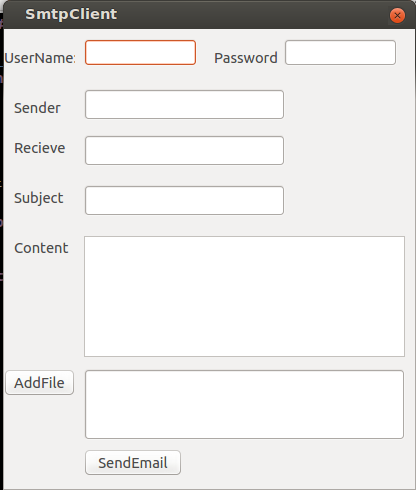

####c++和qt的一些基础知识 
*  一个简单的邮件发送客户端的实现(./qt)：参考src：[SMTP Client for Qt](https://github.com/bluetiger9/SmtpClient-for-Qt.git)
  * 编译qt程序：
    * `$qmake -project`:生成pro工程文件
    * `$qmake`：生成makefile
    * `$make`：编译
    * 在编译的过程中有可能出错，原因是自动生成的pro文件不符合，所以可以生成后根据实际情况改一下
    * ./SMTPEMAIL 可以查看运行结果
  username 和password 可以写你的gmail的用户名和密码（用google的smtp server作为代理）sender和你的username一致 recieve是接收方
  * 利用qt desiginer 生成ui文件转换成c++文件：`uic -o object_name.h/.c source.ui`
  * uic(user interface compiler)：pyqt使用pyuic4
* 一个改编过的c++冒泡排序小程序(./test)>>`$g++ -o object_name file_name`
